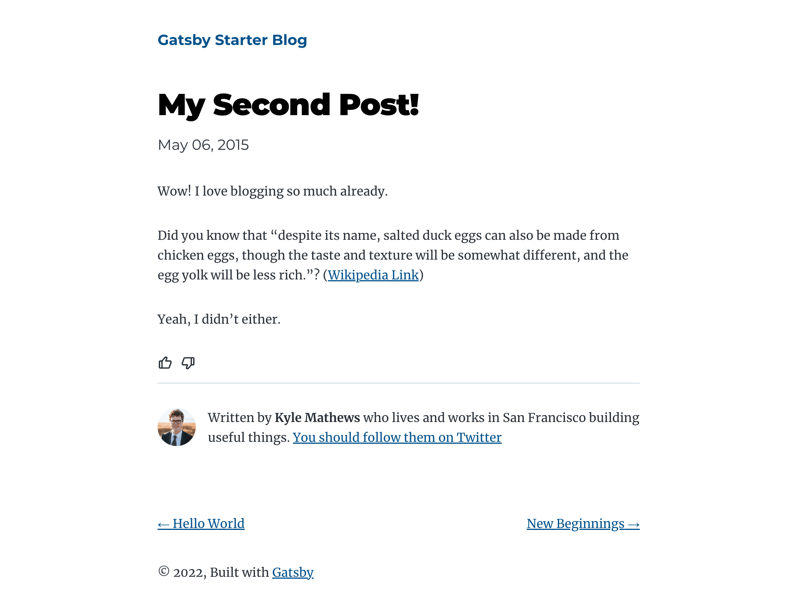

It's gatsby sample blog with [`Feedback API`](https://www.npmjs.com/package/blips-and-chitz-feedback-api-sdk) integration.

In this sample, you can `Like` or `Dislike` blog article.

Implementation you can see in [`Like`](./src/components/like.js) component which used [`useFeedbackApi`](./src/hooks/useFeedbackApi.tsx) hook.

# Start

`gatsby develop`
