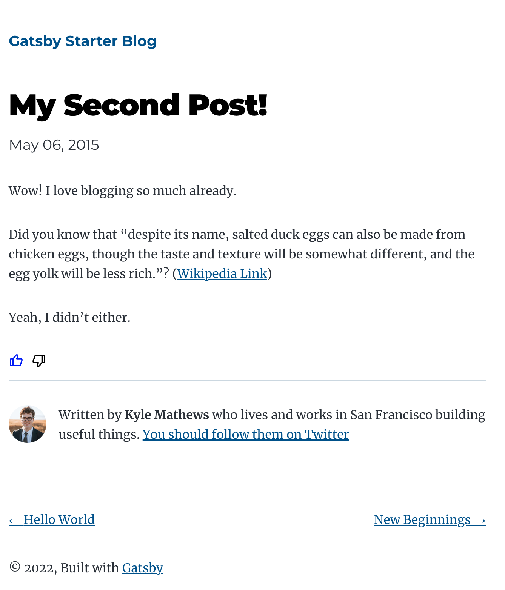

# Sample Gatsby Blog with `Feedback API`

[Demo](https://gatsbyblogmain41640.gatsbyjs.io/)  
[Tutorial](https://rapidapi.com/blips-and-chitz-blips-and-chitz-default/api/feedback-api5/tutorials/2.-how-to-use-feedback-api-js-sdk)

It is gatsby sample blog with [`Feedback API`](https://rapidapi.com/blips-and-chitz-blips-and-chitz-default/api/feedback-api5) integration by using [SDK](https://www.npmjs.com/package/blips-and-chitz-feedback-api-sdk).

In this sample, we implement `Like` or `Dislike` buttons to blog article. You can use this simply to your blogs not only for gatsby.

Implementation you can see in [`Like`](./src/components/like.js) component which used [`useFeedbackApi`](./src/hooks/useFeedbackApi.tsx) hook.

# Start

1. Make `.env` file from `.dist.env`. Change `GATSBY_RAPID_API_KEY` to your Rapid Api Key.
1. Install dependencies  
`npm i`
1. Run  
`npm run develop`
